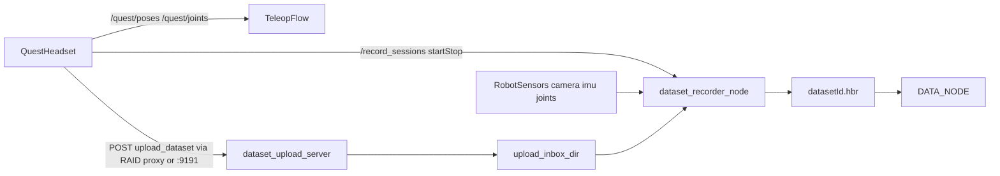

# VR Teleop Architecture — Abstraction Levels and Data Flows

**Version:** 2.0 beta (2025-03-15)

---

## 1. Abstraction levels and mappings

```
┌─────────────────────────────────────────────────────────────────────────────────┐
│ 6. VR CONTROLLER COORDINATES (Quest)                                           │
│    position.x, .y, .z — raw Quest tracking coordinates                         │
│    poses[0]=head, [1]=left_hand, [2]=right_hand                                │
└─────────────────────────────────────────────────────────────────────────────────┘
                                        │
                                        ▼
┌─────────────────────────────────────────────────────────────────────────────────┐
│ 5. CONTROLLER AXIS MAPPING → SOLVER FRAME (body_link)                          │
│    vr_remapper: _controller_to_body_link(x,y,z) → (z, -x, y)                   │
│    body_link: X forward, Y left, Z up                                          │
│    Single place for swaps/sign changes — vr_remapper_node.py                   │
└─────────────────────────────────────────────────────────────────────────────────┘
                                        │
                                        ▼
┌─────────────────────────────────────────────────────────────────────────────────┐
│ 4. OFFSETS AND SCALE                                                           │
│    offset = reference_pose - mapped_vr   (on R_A press)                        │
│    output = mapped_vr + offset                                                │
│    output *= scale  (0.0001..100, sensitivity)                                │
│    All implemented in vr_remapper_node.py                                     │
└─────────────────────────────────────────────────────────────────────────────────┘
                                        │
                                        ▼
┌─────────────────────────────────────────────────────────────────────────────────┐
│ 3. COORDINATES IN body_link                                                    │
│    Target end-effector pose in body_link                                      │
│    fast_ik receives ready poses and calls MoveIt                              │
└─────────────────────────────────────────────────────────────────────────────────┘
                                        │
                                        ▼
┌─────────────────────────────────────────────────────────────────────────────────┐
│ 2. JOINT ANGLES (rad) + JOINT→SERVO MAPPING                                    │
│    MoveIt IK: target_pose → joint angles (rad)                                 │
│    conversion(): different formulas for left/right arm                         │
│    radians_to_servo_position(): angle_deg = clamp(rad×180/π, −120, 120)       │
│    position = (angle_deg + 120) × (1000/240)                                   │
│    Implemented in fast_ik_node.cpp                                            │
└─────────────────────────────────────────────────────────────────────────────────┘
                                        │
                                        ▼
┌─────────────────────────────────────────────────────────────────────────────────┐
│ 1. PHYSICAL SERVOS                                                             │
│    SetBusServosPosition: servo_id → position (0..1000)                        │
│    Single publisher: teleop_fetch → /ros_robot_controller/bus_servo/...       │
└─────────────────────────────────────────────────────────────────────────────────┘
```

---

## 2. High-level architecture diagram

```
                    ┌──────────────────┐
                    │   Quest VR       │
                    │   /quest/poses   │
                    │   /quest/joints  │
                    └────────┬─────────┘
                             │
              ┌──────────────┴──────────────┐
              ▼                             │
    ┌─────────────────────┐                 │
    │   vr_remapper       │                 │
    │   - axis mapping    │                 │
    │   - R_A calibration │                 │
    │   - scale           │                 │
    └──────────┬──────────┘                 │
              │ /teleop_fetch/              │
              │ quest_poses_remapped        │
              ▼                             │
    ┌─────────────────────┐                 │
    │   pose_source       │                 │
    │   VR | manual_poses │                 │
    └──────────┬──────────┘                 │
              │ /teleop_fetch/poses         │
              ▼                             │
    ┌─────────────────────┐                 │
    │   fast_ik_node      │                 │
    │   - IK (MoveIt)     │                 │
    │   - joint→servo     │                 │
    │   - gripper         │                 │
    └──────────┬──────────┘                 │
              │ /teleop_fetch/arm_servo_targets
              ▼                             │
    ┌─────────────────────┐                 │
    │   teleop_fetch      │◄────────────────┘
    │   - X/Y enable      │   /quest/joints
    │   - head            │
    │   - bus_servo       │
    │   - /teleop_state   │   operator sync (String)
    └──────────┬──────────┘
              │
              ▼
    ┌─────────────────────┐     ┌─────────────────────┐
    │ bus_servo/set_position│   │ head_pan/tilt       │
    │ (physical servos)     │   │ /command            │
    └─────────────────────┘     └─────────────────────┘
```

---

## 3. Data flows

### VR → Robot (arms)

| Stage | Topic/Node                         | Data                                       |
|-------|------------------------------------|--------------------------------------------|
| 1     | `/quest/poses`                     | PoseArray: head, left_hand, right_hand     |
| 2     | `vr_remapper`                      | map → offset → scale                       |
| 3     | `/teleop_fetch/quest_poses_remapped` | body_link poses ready for IK             |
| 4     | `pose_source`                      | merge VR / manual                          |
| 5     | `/teleop_fetch/poses`              | PoseArray in body_link                     |
| 6     | `fast_ik_node`                     | IK → joint values → servo positions        |
| 7     | `/teleop_fetch/arm_servo_targets`  | SetBusServosPosition                       |
| 8     | `teleop_fetch`                     | KYR path: to `/kyr/bus_servo_in` when `use_kyr_servo_gateway` and **ACTIVE** and **armed** (see below); bench: direct `servo_topic` when gateway off |

### Operator sync (bidirectional)

**Two different topics:**

| Topic | Type | Publisher | Meaning |
|-------|------|-----------|---------|
| `/teleop_state` | `std_msgs/String` | `teleop_fetch` | On **node start** and on **ACTIVE** after grant — **`stop_control`**. **`get_control`** — on rising edge of **`~operator_arm/joint_name_lx`** (default `L_X`) if arms not yet armed; with **`~arm_stream_requires_lx:=false`** — **`get_control`** right after grant and arms armed without a button. **`stop_control`** — on **`joint_name_ly`** (default `L_Y`) if armed, or **`end_session`**. **Head** on ACTIVE without waiting for a button; **arms** to KYR only when **armed**. Publisher is **latched**. |
| `/teleop_fetch/teleop_state` | `ainex_interfaces/TeleopState` | `fast_ik_node` | IK status stream (ok / out_of_bounds / errors) in the pose processing loop; **does not** replace `/teleop_state`. |

Chain: RAID → grant → **`open_session`** → **ACTIVE** → (if `arm_stream_requires_lx`) **L_X** rising edge on **`~vr_input/joints_topic`** → **armed** → stream **`/teleop_fetch/arm_servo_targets`** → **`/kyr/bus_servo_in`**. **R_A** is in **`vr_remapper`**.

#### KYR session close and operator payment (x402)

The grant closes only on **`/kyr/close_session`**, invoked by **`teleop_fetch`** from **`/teleop_fetch/end_session`** or after **second L_Y press** (if `~end_session_on_second_ly`, default true): first L_Y only disarms (**KYR session stays ACTIVE**), second L_Y ends the session and triggers **`/x402/complete_teleop_payment`**. For a “button in RAID” flow, the app must call **`/teleop_fetch/end_session`** over rosbridge (type `teleop_fetch/EndSession`, field `reason`). Without that, SOL payment does not run.

#### Why arms do not move with fast_ik running

1. **No grant / not ACTIVE** — `teleop_fetch` does not send servos to KYR.
2. **`arm_stream_requires_lx:=true` (default)** — until a **press** (rising edge >0.5) on **`joint_name_lx`**, `arm_servo_targets` are **dropped** (warning to log every ~10 s).
3. **Wrong name in `JointState`** — Quest/rosbridge sends different `name[]`; set **`~operator_arm/joint_name_lx`** for your layout or **`~arm_stream_requires_lx:=false`** on a bench without the button.
4. **No `/quest/joints` stream** — button edge cannot be detected; head may work from poses, arms not until armed.
5. **KYR proxy** — without open session or on `check_policy` deny, commands never reach `/bus_servo/set_position`.
6. **Grant `scope_json` without `allowed_actions`** — RAID sometimes sends `scope_json: "{}"`. The KYR `SessionModule` **normalizes** empty / missing `allowed_actions` to `["*"]` when opening a session so `check_policy(..., "bus_servo")` does not deny all teleop (see `br-kyr` `session_module.py`). Prefer explicit `{"allowed_actions":["*"]}` or `["bus_servo", ...]` in production grants.

#### Bench parameters (`config/teleop.yaml`)

| Parameter | Default | Meaning |
|-----------|---------|---------|
| `use_kyr_servo_gateway` | `true` | If `true`, servo commands go to `/kyr/bus_servo_in`; if `false`, to `servo_topic` (no KYR proxy on that path). |
| `teleop_require_kyr_session` | `true` | If `false`, legacy-style bench: node starts **ACTIVE** without `receive_grant` / KYR; use with `use_kyr_servo_gateway:=false` so commands are not dropped by the proxy. |

#### Automated integration test (no Quest)

With workspace sourced (`devel/setup.bash`):

```bash
cd /path/to/ros_ws && source devel/setup.bash && catkin run_tests teleop_fetch --limit-status-rate 0
```

The `rostest` `test/teleop_kyr_arm_stream.test` starts `kyr_proxy` + `teleop_fetch`, emulates `receive_grant`, `JointState` (L_X edge), and `arm_servo_targets`, and asserts traffic on `/bus_servo/set_position`.

### Calibration (R_A)

| Event        | Action                                                        |
|--------------|---------------------------------------------------------------|
| R_A pressed  | `vr_remapper`: `offset = reference_pose - mapped_vr`         |
| Afterwards   | `output = mapped_vr + offset; output *= scale`               |

### Scale (sensitivity)

| Source                | Topic                    | Range        |
|-----------------------|--------------------------|-------------|
| UI (`teleop_debug.html`) | `/teleop_fetch/scale` | 0.0001..100 |
| Update                | Live while editing field |

---

## 4. Problems solved in beta 1.0

- **Y/Z inversion:** Quest→body_link mapping is centralized in `_controller_to_body_link`, duplicates and post-mapping hacks removed.
- **Calibration without T-pose:** Reference robot pose (arms in front) + R_A. Operator brings arms to a similar pose, offset is computed automatically.
- **Offsets and scale in a single block:** All applied in `vr_remapper`; `fast_ik` receives ready coordinates.
- **Sensitivity:** Single SCALE parameter (0.0001..100), updated from UI in real time.

---

## 5. Configuration files

| File                                   | Purpose                                                  |
|----------------------------------------|----------------------------------------------------------|
| `teleop_fetch/config/vr_remapper.yaml` | Reference pose, default scale                           |
| `teleop_fetch/config/teleop.yaml`      | Servo IDs, arm start positions, head, VR topics         |
| `my_package/config/fast_ik.yaml`       | Gripper, MoveIt groups, left_hand conversion presets    |
| `teleop_fetch/config/dataset_recorder.yaml` | Dataset topics, storage paths, upload API          |

---

## 6. Dataset recording architecture (v1)

When the operator uses **RAID** (remote teleop), they do not call `http://<robot>:9191` directly. Dataset HTTP is exposed on RAID as a **reverse proxy** to the same server on the robot. See [RAID_APP_DATASET_PROXY_SPEC.md](RAID_APP_DATASET_PROXY_SPEC.md) for the contract (`/api/teleop/robots/<robotId>/dataset/...`). On LAN (lab), Quest may still use `:9191` directly.

**Robot UI:** with `enable_dataset_recording:=true`, including `teleop.launch` (or an equivalent launch that starts the dataset stack) runs **`dataset_web_server`** — static files from `teleop_fetch/web` on **`http://<robot>:3002/`** (e.g. `/dataset_dashboard.html`). The dashboard defaults the dataset API base URL to the same hostname as the page, port **9191**. The DATA_NODE URL field defaults from `auto_push.data_node_url` in `dataset_recorder.yaml` (stock default `http://127.0.0.1:8088`), overridden at launch by rosparam `auto_push/data_node_url` from arg **`dataset_data_node_url`** in `teleop.launch` / `br_bringup/ecosystem.launch`; it is persisted in `localStorage` on change. If the UI sends an empty `dataNodeUrl`, `POST /dataset_push` on the robot falls back to the same ROS param `~auto_push/data_node_url`.

**Troubleshooting `ERR_CONNECTION_REFUSED` on :3002:** The HTTP server runs only while the ROS node `/dataset_web_server` is alive. It stops if the process exits or receives a ROS shutdown (for example after log line `shutdown request: [/dataset_web_server] Reason: new node registered with same name` — usually a **second** `roslaunch` was started against the **same** rosmaster as an existing stack). Use **one** teleop/dataset launch graph per rosmaster, or stop the old launch before starting another. Confirm the listener with `ss -tlnp | grep 3002` on the robot and `rosnode list | grep dataset_web`. If `teleop.launch` (and thus the dataset web stack) is not started, **:3002** is not opened unless you launch the dataset nodes separately.



### Recorder responsibilities

- Keep exactly one active dataset recording at a time.
- Capture robot data with high-rate in-memory buffering.
- Finalize robot-side `.hbr` structure on stop event.
- Attach headset operator payload when `POST /upload_dataset` is received (path on robot unchanged; operator URL may be RAID-prefixed).
- Produce `metadata.json` and `lerobot_manifest/*` for downstream conversion.
- Auto-push to DATA_NODE via `POST /sessions/upload` (multipart, see `DATA_NODE/ROBOT_SERVICE_INTEGRATION.md`).
- **Peaq claim:** ROS service `/teleop_fetch/set_peaq_dataset_claim` merges RAID-issued JSON into `metadata.json` as `peaqClaim`. `dataset_upload_server` adds optional multipart part `peaqClaim` on push ([DATA_NODE_PEAQ_CLAIM_SPEC.md](DATA_NODE_PEAQ_CLAIM_SPEC.md)).
