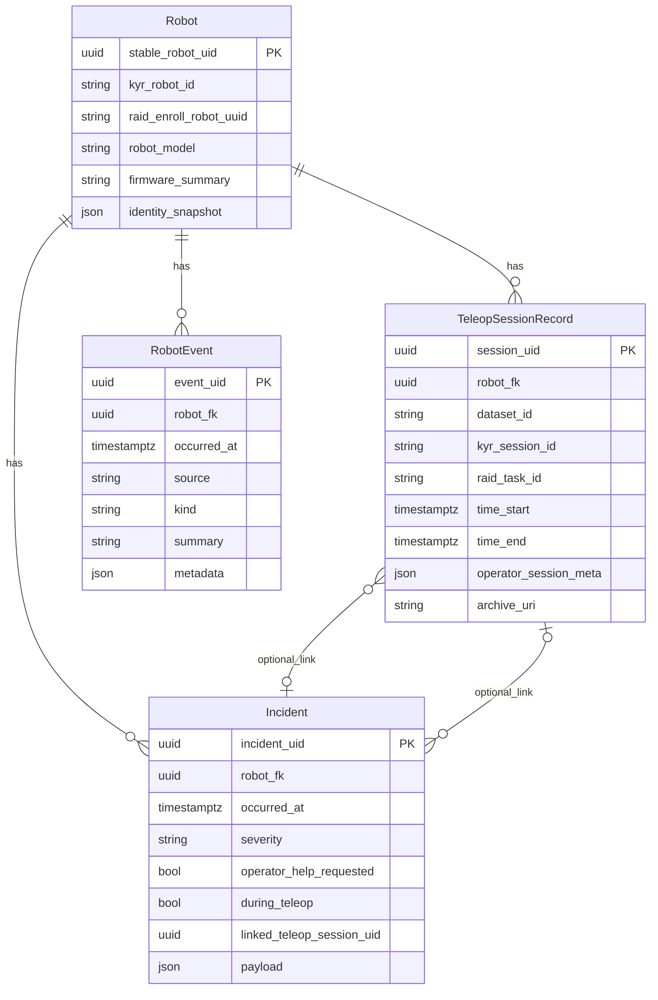

# DATA_NODE — ingest: datasets, robot events, incidents, robots

**Audience:** DATA_NODE service developers (storage, APIs, operator UI).  
**Version:** 2026-04-10.  
**RAID App (help metadata only):** [RAID_APP_DATA_NODE_CORRELATION_SPEC.md](RAID_APP_DATA_NODE_CORRELATION_SPEC.md).  
**Robot periodic upload (non-teleop events):** [br-kyr/DOC/DATA_NODE_SYNC.md](../../br-kyr/DOC/DATA_NODE_SYNC.md).

---

## 1. Purpose

DATA_NODE holds:

1. **Robots** — stable registry (`kyr_robot_id`, `raid_enroll_robot_uuid`, model, firmware hints).
2. **Teleop session cards** — primarily from **`POST /sessions/upload`** (`.hbr` + multipart); see [DATA_NODE_OPERATOR_SESSION_SPEC.md](DATA_NODE_OPERATOR_SESSION_SPEC.md), [HBR.md](HBR.md), [DATA_NODE_PEAQ_CLAIM_SPEC.md](DATA_NODE_PEAQ_CLAIM_SPEC.md).
3. **Incidents** — abnormal situations; may originate from RAID help, robot-reported payloads, or operator entry.
4. **Robot event stream** — **append-only** rows for **non-teleop** or **non-dataset** activity: USB attach/detach signals, dashboard feed lines, audit samples, state-hash transitions, etc. These **do not** replace `.hbr`; they enable fleet timelines without opening archives.

Teleop-linked data continues to arrive mainly **at dataset push** (session end / upload complete). Everything else uses **§5** (batch endpoint) when the robot enables sync in **KYR Black Box** UI.

---

## 2. Conceptual model



---

## 3. Recommended tables

Column names are **DATA_NODE’s**; semantics are normative.

### 3.1 `robots`

As in the previous combined spec: `stable_robot_uid`, `kyr_robot_id`, `raid_enroll_robot_uuid`, `robot_model` / `robot_type`, `firmware_summary`, optional `identity_snapshot` JSON.

### 3.2 `teleop_sessions`

One row per ingested dataset / episode (`dataset_id` unique as today). Fields: `kyr_session_id`, `raid_task_id`, time range from `metadata.json`, `operator_session_meta`, `archive_uri`.

### 3.3 `incidents`

Rows for “something went wrong”: `operator_help_requested`, `during_teleop`, optional `linked_teleop_session_uid`, `payload` (e.g. `situation_report`, `error_context`, RAID help id).

### 3.4 `robot_events` (recommended for fleet timelines)

**Use this table** for batch-ingested rows (§5), not only as an optional cache:

| Field | Description |
|-------|-------------|
| `event_uid` | Primary key; **must** match client `eventUid` for idempotency (UUID v4 from robot). |
| `robot_fk` | Resolved from `kyrRobotId` / `raidRobotUuid` in batch envelope. |
| `occurred_at` | UTC timestamp from client. |
| `source` | `kyr_dashboard` \| `kyr_audit` \| `kyr_state` \| `kyr_incident` \| … |
| `kind` | Short machine-readable type, e.g. `session_open`, `usb_devices_changed`, `audit_allowed`. |
| `summary` | Short text for lists. |
| `metadata` | JSON (full original line or structured fields). |

**Dedup:** `INSERT … ON CONFLICT (event_uid) DO NOTHING` (or equivalent).

---

## 4. Dataset upload (unchanged)

`POST /sessions/upload` — multipart: `datasetId`, `taskName`, `label`, `file`, optional `operatorSessionMeta`, optional `peaqClaim`, optional **`robotCorrelationsMeta`**:

| Key in `robotCorrelationsMeta` | Description |
|-------------------------------|-------------|
| `kyrRobotId` | KYR string robot id. |
| `kyrSessionId` | KYR teleop session id when present in `metadata.json`. |
| `raidRobotUuid` | RAID enroll uuid from robot params. |

Authoritative copy remains **`metadata.json` inside the archive** if multipart disagrees ([DATA_NODE_OPERATOR_SESSION_SPEC.md](DATA_NODE_OPERATOR_SESSION_SPEC.md) §1).

---

## 5. Robot event batch (non-teleop / incremental)

**Normative URL:** `POST {base_url}{batch_path}` (concatenate with no double slash — robot normalizes).

Example: `base_url` = `https://data-node.example`, `batch_path` = `/v1/ingest/robot-events` → `POST https://data-node.example/v1/ingest/robot-events`.

**Auth:** same model as dataset upload (shared secret, bearer token, or mTLS) — document in your `ROBOT_SERVICE_INTEGRATION` doc.

**Content-Type:** `application/json`

**Envelope:**

```json
{
  "schemaVersion": "1.0",
  "kyrRobotId": "robot_001",
  "raidRobotUuid": "",
  "batchId": "550e8400-e29b-41d4-a716-446655440000",
  "sentAtUtc": "2026-04-10T12:00:00Z",
  "events": [
    {
      "eventUid": "6ba7b810-9dad-11d1-80b4-00c04fd430c8",
      "source": "kyr_dashboard",
      "occurredAt": "2026-04-10T11:59:00Z",
      "kind": "session_open",
      "summary": "Teleop session opened (abc)",
      "metadata": {
        "session_id": "abc",
        "robot_id": "robot_001"
      }
    },
    {
      "eventUid": "6ba7b811-9dad-11d1-80b4-00c04fd430c8",
      "source": "kyr_state",
      "occurredAt": "2026-04-10T11:58:30Z",
      "kind": "usb_devices_changed",
      "summary": "USB device list hash changed",
      "metadata": {
        "devices_hash": "…",
        "devices": []
      }
    }
  ]
}
```

**Rules:**

1. **`eventUid`:** required per event; UUID v4; **idempotent** ingest.
2. **`source`:** use controlled vocabulary; ignore unknown `source` values or store under `metadata` only — product choice.
3. **Response:** `200` with `{ "accepted": N, "duplicates": M }` (example); `4xx/5xx` on auth or schema failure.
4. **Size:** cap batch size and body (e.g. 256 KiB–2 MiB); robot should chunk by time window.

**Optional:** `POST /incidents` for structured incident creation (same auth) with fields aligned to §3.3 — exact path and body are DATA_NODE’s; preserve semantics.

---

## 6. When data arrives

| Path | When | Content |
|------|------|---------|
| `POST /sessions/upload` | Dataset finalized / pushed from robot | Teleop episode + correlation metadata |
| `POST …/robot-events` (batch) | Periodic or on trigger from robot (KYR sync worker) | Dashboard, audit, state/USB deltas |
| RAID → DATA_NODE (optional) | Help saved / updated | Incident + help metadata (if you implement relay) |
| `POST /incidents` (optional) | Explicit incident API | Structured incidents |

---

## 7. Backward compatibility

- Older robots without batch ingest: only datasets + RAID (if any).
- Parsers tolerate unknown JSON keys in envelope and `metadata`.

---

## 8. Related documentation

- [RAID_APP_DATA_NODE_CORRELATION_SPEC.md](RAID_APP_DATA_NODE_CORRELATION_SPEC.md)
- [DATA_NODE_OPERATOR_SESSION_SPEC.md](DATA_NODE_OPERATOR_SESSION_SPEC.md)
- [br-kyr/DOC/DATA_NODE_SYNC.md](../../br-kyr/DOC/DATA_NODE_SYNC.md) — KYR UI + worker behaviour
