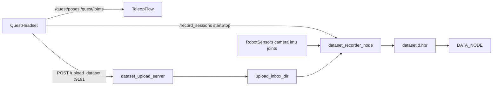

# VR Teleop Architecture — Abstraction Levels and Data Flows

**Version:** 2.0 beta (2025-03-15)

---

## 1. Abstraction levels and mappings

```
┌─────────────────────────────────────────────────────────────────────────────────┐
│ 6. VR CONTROLLER COORDINATES (Quest)                                           │
│    position.x, .y, .z — raw Quest tracking coordinates                         │
│    poses[0]=head, [1]=left_hand, [2]=right_hand                                │
└─────────────────────────────────────────────────────────────────────────────────┘
                                        │
                                        ▼
┌─────────────────────────────────────────────────────────────────────────────────┐
│ 5. CONTROLLER AXIS MAPPING → SOLVER FRAME (body_link)                          │
│    vr_remapper: _controller_to_body_link(x,y,z) → (z, -x, y)                   │
│    body_link: X forward, Y left, Z up                                          │
│    Single place for swaps/sign changes — vr_remapper_node.py                   │
└─────────────────────────────────────────────────────────────────────────────────┘
                                        │
                                        ▼
┌─────────────────────────────────────────────────────────────────────────────────┐
│ 4. OFFSETS AND SCALE                                                           │
│    offset = reference_pose - mapped_vr   (on R_A press)                        │
│    output = mapped_vr + offset                                                │
│    output *= scale  (0.0001..100, sensitivity)                                │
│    All implemented in vr_remapper_node.py                                     │
└─────────────────────────────────────────────────────────────────────────────────┘
                                        │
                                        ▼
┌─────────────────────────────────────────────────────────────────────────────────┐
│ 3. COORDINATES IN body_link                                                    │
│    Target end-effector pose in body_link                                      │
│    fast_ik receives ready poses and calls MoveIt                              │
└─────────────────────────────────────────────────────────────────────────────────┘
                                        │
                                        ▼
┌─────────────────────────────────────────────────────────────────────────────────┐
│ 2. JOINT ANGLES (rad) + JOINT→SERVO MAPPING                                    │
│    MoveIt IK: target_pose → joint angles (rad)                                 │
│    conversion(): different formulas for left/right arm                         │
│    radians_to_servo_position(): angle_deg = clamp(rad×180/π, −120, 120)       │
│    position = (angle_deg + 120) × (1000/240)                                   │
│    Implemented in fast_ik_node.cpp                                            │
└─────────────────────────────────────────────────────────────────────────────────┘
                                        │
                                        ▼
┌─────────────────────────────────────────────────────────────────────────────────┐
│ 1. PHYSICAL SERVOS                                                             │
│    SetBusServosPosition: servo_id → position (0..1000)                        │
│    Single publisher: teleop_fetch → /ros_robot_controller/bus_servo/...       │
└─────────────────────────────────────────────────────────────────────────────────┘
```

---

## 2. High-level architecture diagram

```
                    ┌──────────────────┐
                    │   Quest VR       │
                    │   /quest/poses   │
                    │   /quest/joints  │
                    └────────┬─────────┘
                             │
              ┌──────────────┴──────────────┐
              ▼                             │
    ┌─────────────────────┐                 │
    │   vr_remapper       │                 │
    │   - axis mapping    │                 │
    │   - R_A calibration │                 │
    │   - scale           │                 │
    └──────────┬──────────┘                 │
              │ /teleop_fetch/              │
              │ quest_poses_remapped        │
              ▼                             │
    ┌─────────────────────┐                 │
    │   pose_source       │                 │
    │   VR | manual_poses │                 │
    └──────────┬──────────┘                 │
              │ /teleop_fetch/poses         │
              ▼                             │
    ┌─────────────────────┐                 │
    │   fast_ik_node      │                 │
    │   - IK (MoveIt)     │                 │
    │   - joint→servo     │                 │
    │   - gripper         │                 │
    └──────────┬──────────┘                 │
              │ /teleop_fetch/arm_servo_targets
              ▼                             │
    ┌─────────────────────┐                 │
    │   teleop_fetch      │◄────────────────┘
    │   - X/Y enable      │   /quest/joints
    │   - head            │
    │   - bus_servo       │
    └──────────┬──────────┘
              │
              ▼
    ┌─────────────────────┐     ┌─────────────────────┐
    │ bus_servo/set_position│   │ head_pan/tilt       │
    │ (physical servos)     │   │ /command            │
    └─────────────────────┘     └─────────────────────┘
```

---

## 3. Data flows

### VR → Robot (arms)

| Stage | Topic/Node                         | Data                                       |
|-------|------------------------------------|--------------------------------------------|
| 1     | `/quest/poses`                     | PoseArray: head, left_hand, right_hand     |
| 2     | `vr_remapper`                      | map → offset → scale                       |
| 3     | `/teleop_fetch/quest_poses_remapped` | body_link poses ready for IK             |
| 4     | `pose_source`                      | merge VR / manual                          |
| 5     | `/teleop_fetch/poses`              | PoseArray in body_link                     |
| 6     | `fast_ik_node`                     | IK → joint values → servo positions        |
| 7     | `/teleop_fetch/arm_servo_targets`  | SetBusServosPosition                       |
| 8     | `teleop_fetch`                     | forwards to bus_servo when X = enable      |

### Calibration (R_A)

| Event        | Action                                                        |
|--------------|---------------------------------------------------------------|
| R_A pressed  | `vr_remapper`: `offset = reference_pose - mapped_vr`         |
| Afterwards   | `output = mapped_vr + offset; output *= scale`               |

### Scale (sensitivity)

| Source                | Topic                    | Range        |
|-----------------------|--------------------------|-------------|
| UI (`teleop_debug.html`) | `/teleop_fetch/scale` | 0.0001..100 |
| Update                | Live while editing field |

---

## 4. Problems solved in beta 1.0

- **Y/Z inversion:** Quest→body_link mapping is centralized in `_controller_to_body_link`, duplicates and post-mapping hacks removed.
- **Calibration without T-pose:** Reference robot pose (arms in front) + R_A. Operator brings arms to a similar pose, offset is computed automatically.
- **Offsets and scale in a single block:** All applied in `vr_remapper`; `fast_ik` receives ready coordinates.
- **Sensitivity:** Single SCALE parameter (0.0001..100), updated from UI in real time.

---

## 5. Configuration files

| File                                   | Purpose                                                  |
|----------------------------------------|----------------------------------------------------------|
| `teleop_fetch/config/vr_remapper.yaml` | Reference pose, default scale                           |
| `teleop_fetch/config/teleop.yaml`      | Servo IDs, arm start positions, head, VR topics         |
| `my_package/config/fast_ik.yaml`       | Gripper, MoveIt groups, left_hand conversion presets    |
| `teleop_fetch/config/dataset_recorder.yaml` | Dataset topics, storage paths, upload API          |

---

## 6. Dataset recording architecture (v1)



### Recorder responsibilities

- Keep exactly one active dataset recording at a time.
- Capture robot data with high-rate in-memory buffering.
- Finalize robot-side `.hbr` structure on stop event.
- Attach headset operator payload when `POST /upload_dataset` is received.
- Produce `metadata.json` and `lerobot_manifest/*` for downstream conversion.
- Auto-push to DATA_NODE via `POST /sessions/upload` (multipart, see `DATA_NODE/ROBOT_SERVICE_INTEGRATION.md`).
